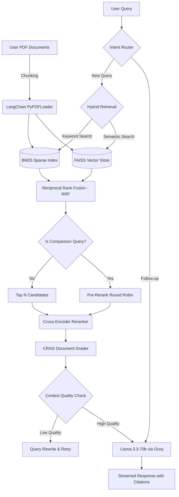

# Hybrid Search RAG Assistant

## Project Overview
The Corrective Hybrid RAG (Retrieval-Augmented Generation) Assistant is a powerful, locally-run AI application designed to intelligently query and chat with your PDF documents. It uses a combination of semantic search (FAISS) and keyword search (BM25) merged via Reciprocal Rank Fusion, followed by a Cross-Encoder reranking step to retrieve the most highly relevant context. 

It is heavily upgraded with **Corrective RAG (CRAG)** principles: an LLM-based Document Grader evaluates every retrieved chunk for relevance, and an Adaptive Router handles conversational follow-ups. For multi-document comparisons, it employs a **Double Round-Robin** diversity filter to guarantee balanced, interleaving context across all uploaded PDFs.

## Features
- **Multi-PDF Upload**: Drag and drop multiple PDF documents simultaneously.
- **Corrective RAG (CRAG)**: A dedicated Document Grader evaluates chunks and strips irrelevant context before generation.
- **Double Round-Robin Comparison**: Automatically detects comparison queries and ensures all uploaded PDFs have an equal, balanced representation in the prompt to prevent "lost in the middle" errors.
- **Conversational Memory & Intent Routing**: Remembers chat history and intelligently skips retrieval for conversational follow-ups.
- **Hybrid Search**: Combines Dense (FAISS) and Sparse (BM25) vector retrieval for superior accuracy.
- **Cross-Encoder Reranking**: Re-evaluates search results for precise, context-aware answers.
- **Source Citations**: Transparently displays exactly which document and page the AI used to formulate its response.
- **Retrieval Inspector**: A robust debug dashboard to view exact retrieved chunks, cross-encoder scores, routing paths, and CRAG grading results.

## Architecture
The application follows an advanced Corrective RAG pipeline:



## Tech Stack
- **Frontend**: [Streamlit](https://streamlit.io/)
- **LLM Engine**: Groq API (`llama-3.3-70b-versatile`)
- **Embeddings**: sentence-transformers (`all-MiniLM-L6-v2`)
- **Reranker**: sentence-transformers (`cross-encoder/ms-marco-MiniLM-L-6-v2`)
- **Vector Database**: FAISS
- **Keyword Search**: rank_bm25
- **Document Framework**: LangChain (`PyPDFLoader`, `RecursiveCharacterTextSplitter`)

## Installation

1. **Clone the repository** (if applicable) and navigate to the project directory:
   ```bash
   cd hybrid-rag
   ```

2. **Create a virtual environment** (recommended):
   ```bash
   python -m venv venv
   source venv/bin/activate  # On Windows use: venv\Scripts\activate
   ```

3. **Install the dependencies**:
   ```bash
   pip install -r requirements.txt
   ```

4. **Configure your environment**:
   Create a `.env` file in the root directory and add your Groq API key:
   ```env
   GROQ_API_KEY=your_groq_api_key_here
   ```

## How to Run

1. Start the Streamlit server:
   ```bash
   streamlit run app.py
   ```
2. Open your browser to the URL provided in the terminal (usually `http://localhost:8501`).
3. Upload one or more PDFs using the sidebar or main uploader.
4. Start chatting!


## Future Improvements
- **Agentic Workflows**: Introduce multi-step reasoning capabilities for complex queries.
- **Additional File Formats**: Support for DOCX, TXT, and Markdown files.
- **Persistent Vector Store**: Save and load FAISS indices across sessions to avoid re-processing large documents.
- **Customizable Prompts**: Allow users to tweak the system prompt via the UI for specialized tasks.

## Author
**Moumita Paul**  
*IIIT Lucknow*
